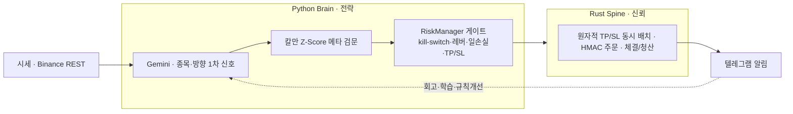

<!-- 현수봇 포폴 repo README (readme-standard). 코드 비공개·포폴 전용 — bespoke index.html + 설계/투자로직. 코드는 별 repo binance-trading-bot. -->
# 현수봇 — Self-Improving Trading Agent (model + harness)
> ‘봇’이 아니라, 스스로 개선되는 시스템. **AI 판단은 한 구성요소일 뿐**, 그 모델을 가두고(리스크 게이트)·측정하고(평가 하네스)·학습시키는(재귀개선 루프) 운영 토대가 본체다.

> 🔗 **라이브 포트폴리오:** [ljhljh0703-cmd.github.io/hyunsoo-bot](https://ljhljh0703-cmd.github.io/hyunsoo-bot/)
> 이 저장소는 **설계·투자 로직**을 공개하는 포트폴리오입니다. 실매매 코드·키는 비공개(clean-room). **투자자문 아님 · 수익 보장 아님 · 전 지표 dry-run.**

## 문제 정의
대부분의 자동매매는 "AI가 알아서 사고팔기"에 초점을 둔다. 고정 파라미터에 박제되면 시장이 변할 때 죽는다. 현수는 반대로, **모델을 둘러싼 harness**(리스크 게이트·평가·기억·페르소나·로그)를 1급 시민으로 설계했다. "어떤 모델을 쓰는가"보다 **"모델을 어떻게 가두고 측정하고 학습시키는가"**를 만들었다.

## 핵심 차별축 — Agent = Model + Harness
- **가둔다 (Guardrail)** — 모든 진입은 결정론적 RiskManager 게이트(킬스위치·일일손실한도·레버리지 상한·TP/SL 필수)를 통과해야 한다. AI가 무엇을 제안하든 실행은 게이트가 결정.
- **측정한다 (Evaluation)** — 성과를 P&L이 아니라 *규칙 준수*로 평가한다(`eval` 하네스, 실 API 없는 dry-run). 이 평가가 재귀개선 루프의 validation 팔.
- **배운다 (Recursive Self-Improvement)** — 거래→청산→회고→BM25 학습 주입→postmortem→규칙 개선·검증이 도는 루프. 외부 트레이딩 에이전트 2종(TradingAgents·TradingCodex)을 해체·흡수해 설계.

## 아키텍처
Python Brain(전략·AI 판단) ↔ Rust Spine(주문 집행·신뢰)을 로컬 REST로 분리했다.

## 투자 로직 (설계)
2단계 진입 검문 + 결정론 리스크 게이트.
- **1차 — Gemini**: 유동성 상위 코인에서 종목·방향(롱/숏/홀드)·레버리지(3x~5x) 선별.
- **2차 — 칼만 Z-Score 메타**: BTC·ETH 공적분 스프레드를 칼만 필터의 동적 헤지비율 β로 추정, Z-Score로 평균회귀 국면을 통계 검증. 두 검문을 통과해야 진입 후보.
- **레짐 필터**: VIX 5d SMA Z-Score > 2.0 또는 Crypto Fear&Greed < 20 → 진입 차단.
- **청산/보호**: TP 백스탑 + 손절(−10% ROE) + 타임스탑(120분). 진입 즉시 보호주문 동시 발주(원자성).
- 진입 임계·청산·타임스탑 같은 전략 상수는 **코드 재배포로만**, 안전 헌법층은 `risk_config.json`으로만 변경(자연어/회고가 못 건드림).

> 참고 문헌: Elliott·van der Hoek·Malcolm (2005) *Pairs trading*, Quantitative Finance 5(3) · 외 공적분·코퓰러·통계차익 연구. "직접 구현 / 배경 검토" 정직 구분.

## 재귀개선 루프 (RSI)
거래 → 청산(실현 ROE) → 회고(반성·기억, **TradingAgents** 흡수) → BM25 학습 주입 → Postmortem(**TradingCodex** 흡수) → 규칙 proposal·검증·audit → 반복 실수 박제 → ↺ 다음 거래. *한 번 짜고 끝나는 코드가 아니라 루프가 도는 자동매매.*
> ※ 반성·기억/제도화 루프는 위 흡수 기반 **설계 반영 단계**(구현 완료 아님, 일부 미배포)로 정직 표기.

## 기술 스택
| 영역 | 사용 |
|---|---|
| 전략(Brain) | Python · NumPy · 칼만 직접 구현 · **Gemini**(종목·방향 + 자연어 의도분류) |
| 신뢰(Spine) | Rust · axum · hmac-sha256 · tokio · WebSocket |
| 거래소 | Binance REST 직접 구현(ccxt 없음) · 서명·레이트리밋 직접 제어 |
| 운용 | 텔레그램 봇(슬래시 + 자연어) · 로컬 REST(127.0.0.1) |

## 코드 · 실행 (비공개)
실매매 코드·API 키는 **공개하지 않습니다**(clean-room). 이 저장소는 *설계·수식·아키텍처·실제 로그*만 담습니다. 자연어/슬래시 명령은 지원하되, **진입 상수(칼만 임계 등)는 자연어로 못 바꾼다 — 코드 전용.** `/reflect → /principle approve`(원칙 KB)는 기록일 뿐 실거래 토글과 무관.

## Evaluation — 성과가 아니라 규칙 준수 (dry-run · `seed=42`)
> ⚠️ **DRY-RUN 시뮬레이션 · 실거래 성과 아님.** 프로세스/리스크 준수 지표만 측정.

| Gate / Metric | 값 |
|---|---|
| 리스크 룰 준수율 | **100.0%** (위반 0) |
| TP/SL 부착률 | **100.0%** (3/3 진입) |
| 킬스위치 차단 예상/실제 | **2 / 2** ✅ |
| 일일 손실 한도 차단 | ✅ 정확 |
| 원칙 준수율 | **100.0%** (미인용 진입 0) |
| 결정 결정론(동일 seed 2회) | ✅ |
| 결정 품질 점수 | **100.0 / 100** |

출처: `eval_report.md`/`metrics.json` · 20틱·3진입·결정론 재현. 전부 dry-run 프로세스·리스크 지표이며 실거래 P&L·수익률이 아니다.

## 정직 · 한계
- **실거래·백테스트 성과는 [측정 전].** dry-run 신호 작동까지만 확인. 수익률·Sharpe·승률 주장 0.
- 게이트 기준은 단일 공적분쌍(BTC·ETH) — 다중·동적 기준쌍은 다음 단계.
- AI 종목 선별의 일관성·레짐 임계 튜닝·체제 전환 지연은 한계로 명시.
- **clean-room** — 코드·API 키·시크릿 미포함. 페르소나 '이현수'(소설 〈초파리〉)는 **창작 기반**.

## License
MIT
